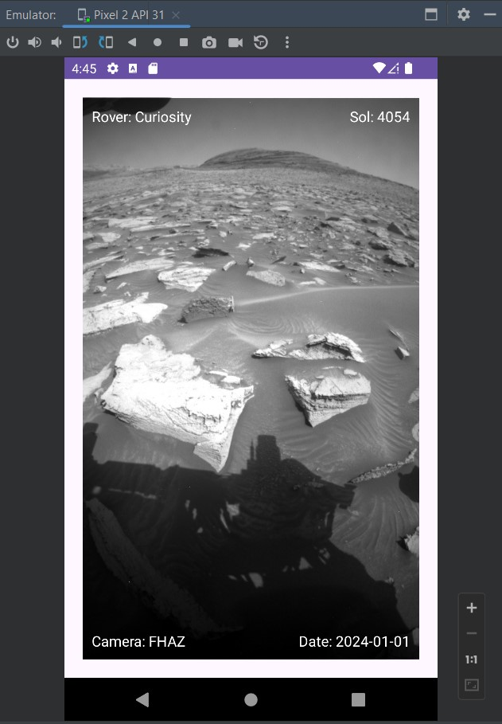

# Урок 17. Работа с массивами данных

### Цели практической работы:
Потренироваться работать со списками.

### Что нужно сделать:
 Разработайте небольшое приложение для отображения списка фотографий с Марса. 
 Для этого воспользуйтесь открытым Nasa API.

### Этапы работы
1. Создайте новый проект и подключите к нему RecyclerView.
2. Для загрузки информации используйте MarsRoverPhotosAPI.
3. Подключите необходимые библиотеки для загрузки данных из сети и навигации (если это необходимо)
4. Реализуйте загрузку данных изNasaAPI с помощью библиотеки для загрузки данных, создайте необходимые классы и 
   опишите модель данных в соответствии с документацией API. Для загрузки и отображения данных используйте шаблон MVVM.
5. Проанализируйте полученный класс и создайте разметку для элемента списка.
6. Создайте активити или фрагмент для отображения списка. Добавьте в разметку RecyclerView и установите 
   необходимый LayoutManager.
7. Создайте Adapter и ViewHolder для отображения загруженных данных на UI. Реализуйте необходимые функции у адаптера 
   и установите адаптер в RecyclerView. Для асинхронной загрузки изображений используйте библиотеку Glide.
8. В результате у вас должен получиться прокручивающийся список, который отображает фотографии и информацию о них.
   Поэкспериментируйте с разными LayoutManagers.
9. Сделайте так, чтобы можно было открыть фотографию на весь экран.
   Для этого:
   ○ установите clickListener для элемента списка,
   ○ создайте отдельный экран для просмотра изображения,
   ○ передайте URL фотографии в этот экран,
   ○ вновь отобразите фотографию с помощью Glide (Glide кеширует изображения, поэтому повторной загрузки 
      изображения не будет).
10. Выполните по желанию
    Nasa API поддерживает пагинацию. Для этого необходимо добавить в запрос query-параметр page. 
    Подключите библиотеку Paging 3 к проекту.
11. Выполните по желанию
    Добейтесь постраничной загрузки изображений. Для этого реализуйте и подключите необходимые компоненты 
    библиотеки Paging 3 к RecyclerView:
    ○ PagingDataSource,
    ○ PagedAdapter,
    ○ Pager и Flow<PagingData<YOUR_CLASS>>

=========================================================================

## Демонстрация решения:

Screen App:

